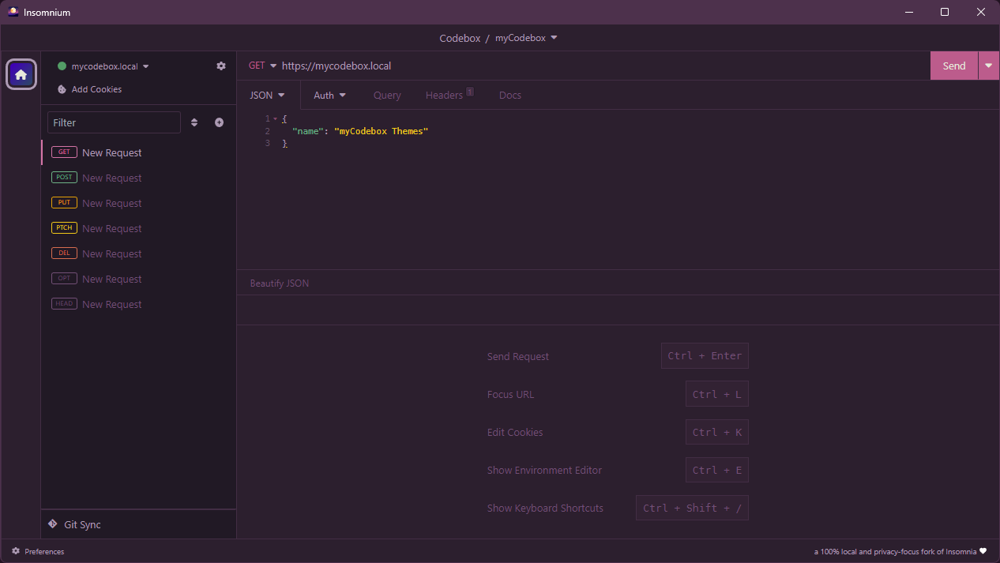

# MyCodebox **Paraíso** for [Insomnia](http://insomnia.rest)

> A dark theme for [Insomnia](http://insomnia.rest)

## [Install](./INSTALL.md)

1. In Insomnia, go to _Application_ and select _Preferences_
2. Click on _Plugins_
3. Paste `insomnia-plugin-theme-mycodebox` into the package name field
4. Click on _Install Plugin_

## Activating theme

1. Go to _Application_ and select _Preferences_
2. Click on _Themes_
3. Select **myCodebox** to apply the theme

## License

[MIT License](./LICENSE)
